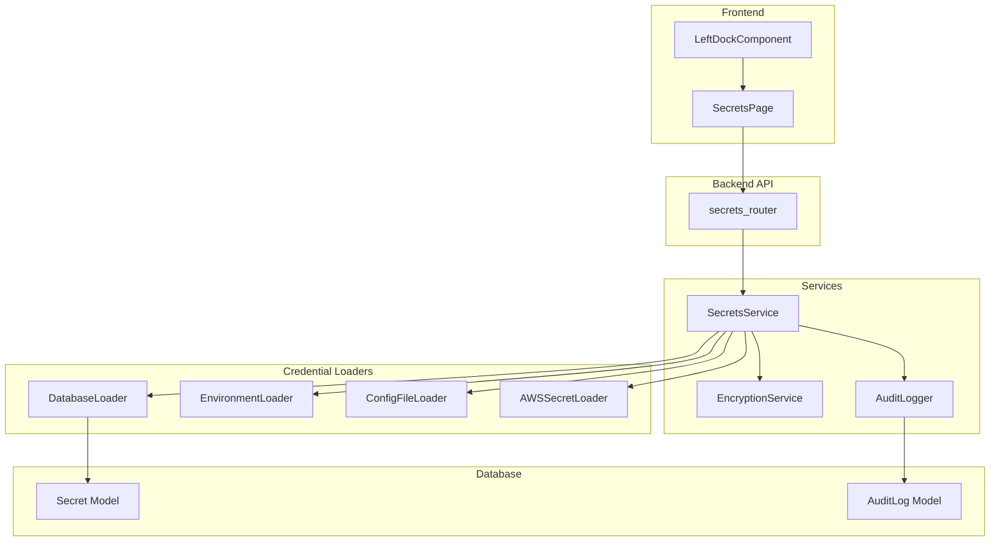

# Design Document: Secrets Management

## Overview

This design document describes the architecture and implementation of a comprehensive Secrets Management system for KozmoAI. The system provides secure storage, retrieval, and management of sensitive credentials using Fernet symmetric encryption, with support for multiple credential sources (database, environment variables, YAML config files, AWS Secrets Manager).

The design follows existing KozmoAI patterns, extending the database models, services, and API structure already established in the codebase.

## Architecture



## Components and Interfaces

### 1. Database Models

#### Secret Model
Location: `src/backend/base/kozmoai/services/database/models/secret/model.py`

```python
class SecretBase(SQLModel):
    name: str
    key: str  # ConfigKey enum value
    encrypted_value: str
    category: SecretCategory  # AWS, Azure, GCP, Database, SSH, Custom
    profile: SecretProfile  # default, development, staging, production

class Secret(SecretBase, table=True):
    id: UUID
    created_at: datetime
    updated_at: datetime
    user_id: UUID  # Foreign key to User

class SecretCreate(SecretBase):
    value: str  # Plaintext, encrypted before storage

class SecretRead(SQLModel):
    id: UUID
    name: str
    key: str
    masked_value: str  # "********"
    category: SecretCategory
    profile: SecretProfile
    created_at: datetime

class SecretDecrypted(SecretRead):
    value: str  # Plaintext value (admin only)
```

#### AuditLog Model
Location: `src/backend/base/kozmoai/services/database/models/audit_log/model.py`

```python
class AuditLog(SQLModel, table=True):
    id: UUID
    user_id: UUID
    action_type: AuditAction  # CREATE, UPDATE, DELETE, DECRYPT
    secret_id: UUID
    timestamp: datetime
    ip_address: str
```

### 2. Enumerations

Location: `src/backend/base/kozmoai/services/secrets/constants.py`

```python
class SecretCategory(StrEnum):
    AWS = "AWS"
    AZURE = "Azure"
    GCP = "GCP"
    DATABASE = "Database"
    SSH = "SSH"
    CUSTOM = "Custom"

class SecretProfile(StrEnum):
    DEFAULT = "default"
    DEVELOPMENT = "development"
    STAGING = "staging"
    PRODUCTION = "production"

class AuditAction(StrEnum):
    CREATE = "CREATE"
    UPDATE = "UPDATE"
    DELETE = "DELETE"
    DECRYPT = "DECRYPT"

class ConfigKey(StrEnum):
    # AWS
    AWS_ACCESS_KEY_ID = "AWS_ACCESS_KEY_ID"
    AWS_SECRET_ACCESS_KEY = "AWS_SECRET_ACCESS_KEY"
    AWS_REGION = "AWS_REGION"
    # ... (subset of keys from Mage AI's ConfigKey)
    # SSH
    SSH_HOST = "SSH_HOST"
    SSH_PORT = "SSH_PORT"
    SSH_USERNAME = "SSH_USERNAME"
    SSH_PASSWORD = "SSH_PASSWORD"
    SSH_PRIVATE_KEY = "SSH_PRIVATE_KEY"
```

### 3. Encryption Service

Location: `src/backend/base/kozmoai/services/secrets/encryption.py`

```python
class EncryptionService:
    def __init__(self, encryption_key: str):
        # Validate key length >= 32 chars
        # Initialize Fernet cipher
    
    def encrypt(self, plaintext: str) -> str:
        # Returns base64-encoded encrypted value
    
    def decrypt(self, encrypted_value: str) -> str:
        # Returns plaintext value
```

### 4. Credential Loaders

Location: `src/backend/base/kozmoai/services/secrets/loaders/`

Following the Mage AI pattern from `archive/mage-ai-master/mage_ai/io/config.py`:

```python
class BaseCredentialLoader(ABC):
    @abstractmethod
    def contains(self, key: str) -> bool: ...
    
    @abstractmethod
    def get(self, key: str) -> Optional[str]: ...

class DatabaseLoader(BaseCredentialLoader):
    # Loads from Secret table

class EnvironmentLoader(BaseCredentialLoader):
    # Loads from os.environ

class ConfigFileLoader(BaseCredentialLoader):
    # Loads from YAML file with profile support

class AWSSecretLoader(BaseCredentialLoader):
    # Loads from AWS Secrets Manager via boto3
```

### 5. Secrets Service

Location: `src/backend/base/kozmoai/services/secrets/service.py`

```python
class SecretsService:
    def __init__(self, encryption_service, loaders: list[BaseCredentialLoader]):
        self.encryption = encryption_service
        self.loaders = loaders  # Ordered: DB, Env, Config, AWS
    
    # CRUD operations
    async def create_secret(self, user_id, data: SecretCreate) -> SecretRead
    async def get_secret(self, user_id, secret_id) -> SecretRead
    async def list_secrets(self, user_id, category?, profile?) -> list[SecretRead]
    async def update_secret(self, user_id, secret_id, data) -> SecretRead
    async def delete_secret(self, user_id, secret_id) -> None
    
    # Decryption (admin only)
    async def decrypt_secret(self, user_id, secret_id) -> SecretDecrypted
    
    # Import
    async def import_yaml(self, user_id, yaml_content) -> ImportResult
    
    # Credential resolution (checks all loaders in order)
    def get_credential(self, key: str, profile: str) -> Optional[str]
```

### 6. API Endpoints

Location: `src/backend/base/kozmoai/api/v1/secrets.py`

| Method | Endpoint | Description | Auth |
|--------|----------|-------------|------|
| GET | /api/v1/secrets | List secrets (masked) | User |
| GET | /api/v1/secrets/{id} | Get single secret | User |
| POST | /api/v1/secrets | Create secret | Admin |
| PUT | /api/v1/secrets/{id} | Update secret | Admin |
| DELETE | /api/v1/secrets/{id} | Delete secret | Admin |
| POST | /api/v1/secrets/{id}/decrypt | Decrypt secret | Admin |
| GET | /api/v1/secrets/profiles | List profiles | User |
| POST | /api/v1/secrets/import | Import YAML | Admin |

### 7. Frontend Components

#### SecretsPage
Location: `src/frontend/src/pages/SecretsPage/index.tsx`

- Table displaying secrets with columns: name, key, category, profile, masked_value, created_at, actions
- Search input for filtering by name/key
- Category dropdown filter
- Profile dropdown filter
- Create/Edit modal with form fields
- Delete confirmation dialog
- Decrypt button (admin only) with 30-second auto-hide

#### LeftDockComponent Update
Location: `src/frontend/src/components/core/leftDockComponent/index.tsx`

Add Secrets button with Key icon between Catalog and Settings buttons.

## Data Models

### Secret Entity

| Field | Type | Description |
|-------|------|-------------|
| id | UUID | Primary key |
| name | string | Display name |
| key | string | ConfigKey enum value |
| encrypted_value | string | Fernet-encrypted value |
| category | SecretCategory | AWS, Azure, GCP, Database, SSH, Custom |
| profile | SecretProfile | default, development, staging, production |
| created_at | datetime | Creation timestamp |
| updated_at | datetime | Last update timestamp |
| user_id | UUID | Foreign key to User |

### AuditLog Entity

| Field | Type | Description |
|-------|------|-------------|
| id | UUID | Primary key |
| user_id | UUID | User who performed action |
| action_type | AuditAction | CREATE, UPDATE, DELETE, DECRYPT |
| secret_id | UUID | Affected secret |
| timestamp | datetime | When action occurred |
| ip_address | string | Client IP address |


## Correctness Properties

*A property is a characteristic or behavior that should hold true across all valid executions of a system—essentially, a formal statement about what the system should do. Properties serve as the bridge between human-readable specifications and machine-verifiable correctness guarantees.*

### Property 1: Encryption Round-Trip
*For any* plaintext secret value, encrypting it and then decrypting it SHALL return the original plaintext value.
**Validates: Requirements 1.1, 1.2, 2.1**

### Property 2: Masked Values on Retrieval
*For any* secret retrieved via the list or get endpoints, the returned value SHALL be masked (e.g., "********") and SHALL NOT contain the plaintext or encrypted value.
**Validates: Requirements 1.3, 4.1**

### Property 3: Non-Admin Rejection
*For any* non-admin user attempting to create, update, delete, or decrypt a secret, the Secrets_Service SHALL return a 403 Forbidden response.
**Validates: Requirements 2.2, 3.6**

### Property 4: Filtering Returns Matching Results
*For any* filter criteria (search query, category, or profile), all returned secrets SHALL match the specified criteria.
**Validates: Requirements 4.3, 4.4, 4.5**

### Property 5: Loader Priority Order
*For any* credential key that exists in multiple sources (Database, Environment, Config File, AWS), the value from the highest-priority source (Database > Environment > Config > AWS) SHALL be returned.
**Validates: Requirements 5.4**

### Property 6: Audit Logging Completeness
*For any* create, update, delete, or decrypt operation on a secret, an audit log entry SHALL be created containing user_id, action_type, secret_id, timestamp, and ip_address.
**Validates: Requirements 2.5, 3.3, 10.1, 10.2**

### Property 7: Rate Limiting on Decrypt
*For any* user making more than 10 decrypt requests within a 60-second window, subsequent requests SHALL return a 429 Too Many Requests response.
**Validates: Requirements 10.3, 10.4**

### Property 8: Encryption Key Validation
*For any* encryption key shorter than 32 characters, the EncryptionService initialization SHALL raise a configuration error.
**Validates: Requirements 10.5, 10.6**

### Property 9: YAML Import Upsert Behavior
*For any* YAML import containing a credential with the same name and profile as an existing secret, the existing secret SHALL be updated rather than creating a duplicate.
**Validates: Requirements 6.4**

### Property 10: Unique Name Validation
*For any* attempt to create a secret with a name that already exists for the same user and profile, the Secrets_Service SHALL reject the request with a validation error.
**Validates: Requirements 3.1**

## Error Handling

| Error Condition | Response | HTTP Status |
|-----------------|----------|-------------|
| Secret not found | `{"detail": "Secret not found"}` | 404 |
| Unauthorized (not logged in) | `{"detail": "Not authenticated"}` | 401 |
| Forbidden (not admin) | `{"detail": "Admin privileges required"}` | 403 |
| Duplicate name | `{"detail": "Secret with this name already exists"}` | 400 |
| Invalid YAML format | `{"detail": "Invalid YAML structure"}` | 400 |
| Rate limit exceeded | `{"detail": "Rate limit exceeded. Try again later."}` | 429 |
| Invalid encryption key | Configuration error on startup | N/A |
| Decryption failure | `{"detail": "Failed to decrypt secret"}` | 500 |

## Testing Strategy

### Unit Tests
- EncryptionService: encrypt/decrypt methods
- Credential loaders: contains/get methods with mocked sources
- SecretsService: CRUD operations with mocked database
- YAML parser: valid and invalid YAML structures

### Property-Based Tests
Each correctness property will be implemented as a property-based test using Hypothesis (Python) or fast-check (TypeScript):

1. **Encryption round-trip**: Generate random strings, verify encrypt→decrypt returns original
2. **Masked values**: Generate secrets, verify list/get returns masked values
3. **Non-admin rejection**: Generate non-admin users, verify 403 on protected operations
4. **Filtering**: Generate secrets with various categories/profiles, verify filter accuracy
5. **Loader priority**: Set up credentials in multiple sources, verify priority order
6. **Audit logging**: Perform operations, verify audit log entries exist with required fields
7. **Rate limiting**: Make rapid decrypt requests, verify 429 after threshold
8. **Key validation**: Generate short keys, verify initialization fails
9. **YAML upsert**: Import same credential twice, verify single record updated
10. **Unique name**: Create duplicate names, verify rejection

### Integration Tests
- Full API endpoint testing with real database
- Frontend component rendering with mock API
- Left dock navigation to /secrets route
