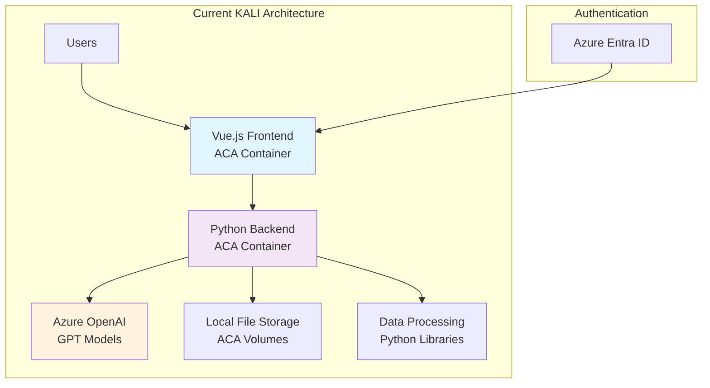
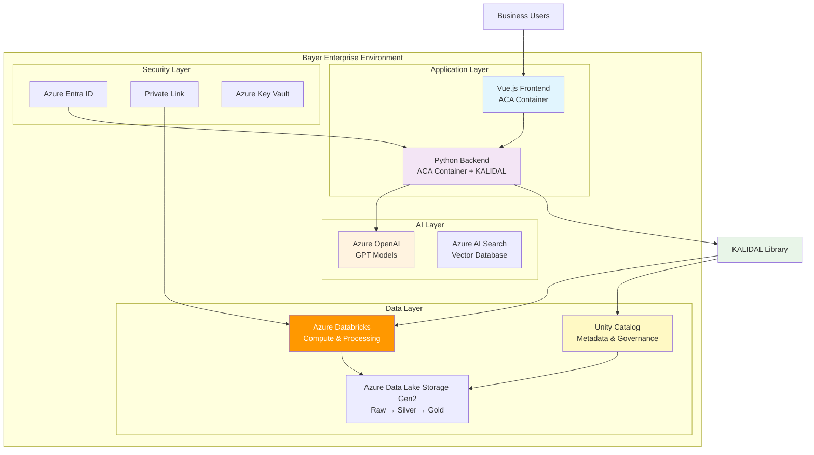
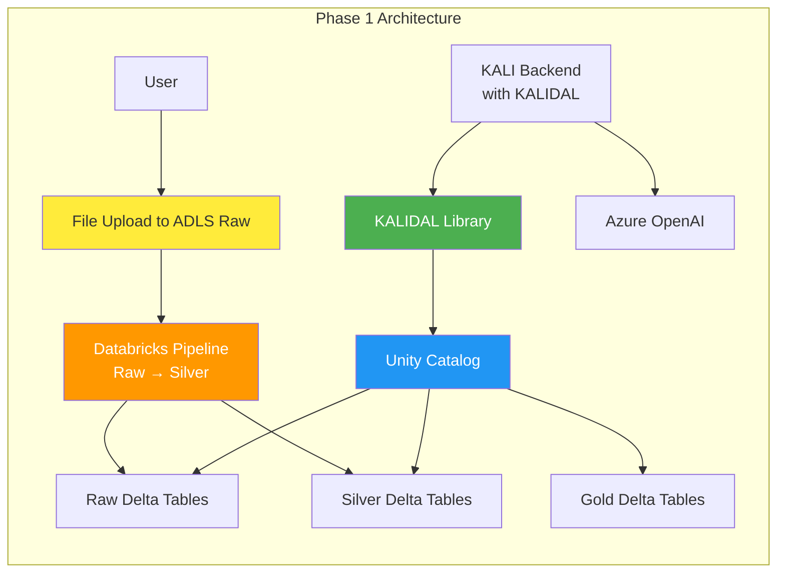
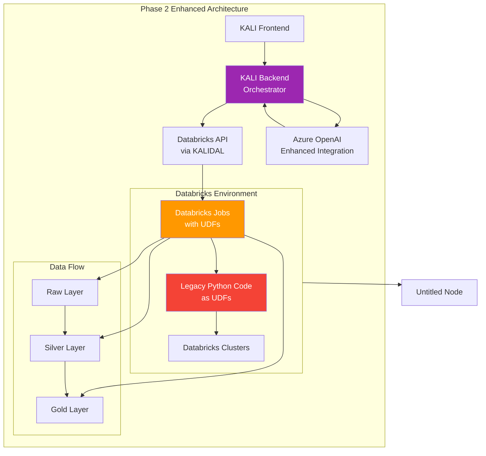
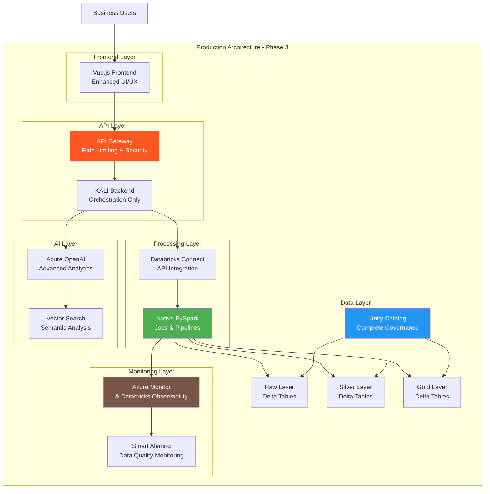
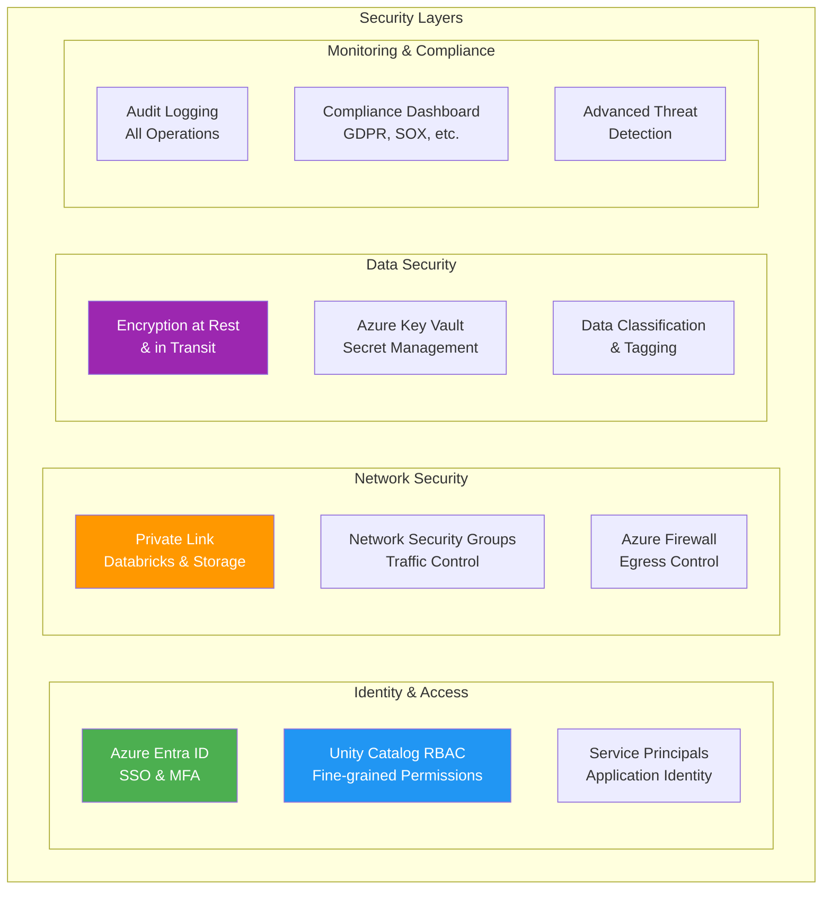
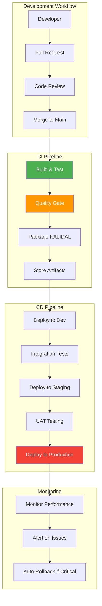

# KALI-Databricks Integration Architecture

## Executive Summary

This document outlines the architectural transformation of KALI, BCG's data quality and analysis application, to integrate with Azure Databricks and Unity Catalog for Bayer's cloud environment. The migration is planned in three strategic phases over approximately 3 sprints (4 months including August holiday).

**Current State**: KALI operates on Azure Container Apps (ACA) with frontend (Vue.js) and backend (Python) components, processing uploaded files and interfacing with Azure OpenAI for data analysis.

**Target State**: A unified lakehouse architecture leveraging Azure Databricks, Unity Catalog, and Delta tables for enterprise-grade data governance, processing, and AI integration.

## Table of Contents

1. [Project Context](#project-context)
2. [Current Architecture](#current-architecture)
3. [Target Architecture](#target-architecture)
4. [Phase-by-Phase Implementation](#phase-by-phase-implementation)
5. [Security and Governance](#security-and-governance)
6. [Data Access Layer (KALIDAL)](#data-access-layer-kalidal)
7. [Performance and Scalability](#performance-and-scalability)
8. [Deployment Strategy](#deployment-strategy)
9. [Risk Assessment and Mitigation](#risk-assessment-and-mitigation)
10. [Timeline and Deliverables](#timeline-and-deliverables)

## Project Context

### Business Drivers
- **Data Governance**: Leverage Unity Catalog for enterprise-wide data governance
- **Scalability**: Support larger datasets and more complex analytics workloads
- **AI Integration**: Enhanced integration with Azure OpenAI for advanced data analysis
- **Client Requirements**: Alignment with Bayer's existing Azure Databricks infrastructure
- **Data Lineage**: Complete tracking of data transformations from raw to gold layers

### Key Stakeholders
- **BCG Team**: Solution architects, data engineers, frontend developers
- **Bayer Team**: Data platform team, security team, business users
- **Microsoft**: Azure support for enterprise deployment

## Current Architecture



### Current Architecture Limitations
1. **Scalability**: Limited by container resources for large datasets
2. **Data Governance**: No centralized catalog or lineage tracking
3. **Storage**: Temporary file storage without persistence
4. **Processing Power**: Limited compute resources for complex transformations
5. **Data Sharing**: No mechanism for enterprise data sharing
6. **Monitoring**: Basic application monitoring without data pipeline observability

## Target Architecture



## Phase-by-Phase Implementation

### Phase 1: Foundation and Data Integration (Sprint 2 - Remaining 2 weeks)

#### Objectives
- Establish ADLS Gen2 storage with medallion architecture
- Implement basic Databricks pipeline for data ingestion
- Develop KALIDAL (Kali Data Access Layer) library
- Migrate data flow from file uploads to ADLS-based processing

#### Key Components



#### Implementation Details

**1. ADLS Gen2 Setup**
```yaml
Storage Structure:
├── raw/
│   ├── uploads/
│   │   ├── {date}/
│   │   │   ├── {user_id}/
│   │   │   │   └── {file_name}
│   └── processed/
├── silver/
│   └── enriched_data/
└── gold/
    └── analytics_ready/
```

**2. Unity Catalog Structure**
```sql
-- Catalog Organization
CREATE CATALOG IF NOT EXISTS kali_prod;
CREATE CATALOG IF NOT EXISTS kali_dev;

-- Schema Organization (per environment)
CREATE SCHEMA IF NOT EXISTS kali_prod.raw_layer;
CREATE SCHEMA IF NOT EXISTS kali_prod.silver_layer;
CREATE SCHEMA IF NOT EXISTS kali_prod.gold_layer;
CREATE SCHEMA IF NOT EXISTS kali_prod.metadata;
```

**3. KALIDAL Library Architecture**
```python
# KALIDAL Core Classes
class DatabricksConnector:
    """Manages Databricks SQL connections and authentication"""
    
class UnityTableManager:
    """Handles Unity Catalog table operations"""
    
class DataQualityEngine:
    """Implements data quality checks and corrections"""
    
class MetadataTracker:
    """Tracks data lineage and transformations"""

# Key Functions
def read_data(catalog_name: str, table_name: str, **kwargs) -> DataFrame
def write_data(df: DataFrame, catalog_name: str, table_name: str, **kwargs) -> bool
def update_data(catalog_name: str, table_name: str, updates: dict, **kwargs) -> bool
def get_table_metadata(catalog_name: str, table_name: str) -> dict
```

**4. Security Configuration**
- Service Principal for KALI backend
- Unity Catalog permissions for raw/silver layer access
- Private Link connections between ACA and Databricks
- Azure Key Vault for credential management

#### Deliverables
- [ ] ADLS Gen2 storage account with medallion structure
- [ ] Unity Catalog setup with security groups
- [ ] Basic Databricks workspace and clusters
- [ ] KALIDAL library v1.0 (wheel package)
- [ ] Updated KALI backend with KALIDAL integration
- [ ] Data ingestion pipeline (raw → silver → gold)

### Phase 2: Processing Migration and Orchestration (Sprint 3 - 1 month)

#### Objectives
- Migrate core data processing logic to Databricks
- Implement UDF-based approach for legacy code backward compatibility
- Enhance KALIDAL with advanced features
- Establish complete data pipeline orchestration

#### Architecture Enhancement



#### Implementation Details

**1. UDF Migration Strategy**
```python
# Example UDF Implementation
from pyspark.sql.functions import udf
from pyspark.sql.types import StringType
import pandas as pd

@udf(returnType=StringType())
def legacy_data_cleaner(data_column):
    """Migrate existing KALI data cleaning logic as UDF"""
    # Existing KALI Python logic here
    return cleaned_data

# Register UDF in Databricks
spark.udf.register("kali_data_cleaner", legacy_data_cleaner)
```

**2. Enhanced KALIDAL Features**
```python
# Advanced KALIDAL Features
class JobOrchestrator:
    """Manages Databricks job execution and monitoring"""
    
    def submit_job(self, job_config: dict) -> str:
        """Submit and monitor Databricks jobs"""
        
    def get_job_status(self, job_id: str) -> dict:
        """Monitor job execution status"""

class DataLineageTracker:
    """Enhanced lineage tracking with Unity Catalog integration"""
    
    def track_transformation(self, source_table: str, target_table: str, 
                           transformation_logic: str) -> bool:
        """Track data transformations for audit and debugging"""

class QualityGateway:
    """Implement data quality gates between layers"""
    
    def validate_data_quality(self, table_name: str, 
                            quality_rules: list) -> bool:
        """Validate data before promoting to next layer"""
```

**3. Integration Patterns**
```python
# Backend Integration Pattern
class KALIDataPipeline:
  
    def __init__(self):
        self.kalidal = KALIDAL(config)
        
    async def process_user_data(self, user_id: str, file_path: str):
        # Step 1: Read from raw layer
        raw_data = self.kalidal.read_data("kali_prod", "raw_layer.user_uploads")
        
        # Step 2: Submit Databricks job for processing
        job_id = self.kalidal.submit_job({
            "task": "data_cleaning",
            "source_table": f"kali_prod.raw_layer.user_uploads",
            "target_table": f"kali_prod.silver_layer.cleaned_data",
            "user_id": user_id
        })
        
        # Step 3: Monitor job completion
        await self.kalidal.wait_for_job_completion(job_id)
        
        # Step 4: Read processed data for OpenAI analysis
        processed_data = self.kalidal.read_data("kali_prod", "silver_layer.cleaned_data")
        
        return processed_data
```

#### Deliverables
- [ ] Migrated processing jobs to Databricks with UDFs
- [ ] Enhanced KALIDAL library v2.0
- [ ] Job orchestration framework
- [ ] Data quality gates implementation
- [ ] Integration testing suite
- [ ] Performance optimization for UDF-based processing


### Phase 3: Native PySpark Optimization (Final Sprint - Late August 2025)

#### Objectives
- Replace UDFs with native PySpark operations for optimal performance
- Implement advanced data governance and monitoring
- Complete AI/ML pipeline integration
- Production readiness and performance optimization

#### Final Architecture



#### Implementation Details

**1. Native PySpark Implementation**
```python
# Replace UDFs with native PySpark operations
from pyspark.sql import SparkSession
from pyspark.sql.functions import *
from pyspark.sql.types import *

class NativeDataProcessor:
  
    def __init__(self, spark: SparkSession):
        self.spark = spark
    
    def clean_data_native(self, df):
        """Native PySpark data cleaning - much faster than UDFs"""
        return (df
                .filter(col("data_column").isNotNull())
                .withColumn("cleaned_data", 
                           regexp_replace(col("data_column"), "[^a-zA-Z0-9]", ""))
                .withColumn("data_quality_score", 
                           when(length(col("cleaned_data")) > 0, 1.0).otherwise(0.0))
                .cache())  # Cache for performance
    
    def enrich_with_ml_features(self, df):
        """Add ML features using native Spark ML"""
        from pyspark.ml.feature import VectorAssembler, StandardScaler
        
        assembler = VectorAssembler(
            inputCols=["feature1", "feature2", "feature3"],
            outputCol="features"
        )
        
        scaler = StandardScaler(
            inputCol="features",
            outputCol="scaled_features"
        )
        
        return scaler.fit(assembler.transform(df)).transform(assembler.transform(df))
```

**2. Advanced Governance and Monitoring**
```python
# Data Governance Implementation
class GovernanceEngine:
  
    def __init__(self, unity_catalog):
        self.unity = unity_catalog
    
    def apply_data_classification(self, table_name: str):
        """Automatically classify sensitive data"""
        pass
    
    def enforce_retention_policies(self, catalog: str, schema: str):
        """Implement data retention policies"""
        pass
    
    def audit_data_access(self, user_id: str, table_name: str):
        """Track all data access for compliance"""
        pass


# Advanced Monitoring
class DataObservability:
    def __init__(self):
        self.metrics_collector = MetricsCollector()
    
    def track_data_freshness(self, table_name: str):
        """Monitor data freshness and alert on stale data"""
        pass
    
    def monitor_data_drift(self, table_name: str, baseline_stats: dict):
        """Detect statistical drift in data"""
        pass
    
    def quality_score_monitoring(self, table_name: str):
        """Continuous data quality monitoring"""
        pass
```

**3. Production Optimization**
```python
# Performance Optimization Configuration
DATABRICKS_CONFIG = {
    "cluster_config": {
        "node_type_id": "Standard_D4ds_v4",  # Optimized for memory-intensive workloads
        "min_workers": 2,
        "max_workers": 10,
        "autotermination_minutes": 30,
        "enable_elastic_disk": True,
        "enable_local_disk_encryption": True
    },
    "spark_config": {
        "spark.sql.adaptive.enabled": "true",
        "spark.sql.adaptive.coalescePartitions.enabled": "true",
        "spark.sql.adaptive.skewJoin.enabled": "true",
        "spark.sql.execution.arrow.pyspark.enabled": "true",
        "spark.sql.execution.arrow.maxRecordsPerBatch": "10000"
    }
}
```

#### Deliverables
- [ ] Complete native PySpark implementation
- [ ] Advanced governance and compliance features
- [ ] Production monitoring and alerting
- [ ] Performance optimization and tuning
- [ ] Comprehensive documentation and runbooks
- [ ] User training materials


## Security and Governance

### Security Architecture



### Unity Catalog Security Model

**1. Catalog Organization by Environment**
```sql
-- Production Catalog with strict access
CREATE CATALOG kali_prod 
COMMENT 'Production KALI data with strict governance';

-- Development Catalog with broader access
CREATE CATALOG kali_dev 
COMMENT 'Development KALI data for testing';

-- Shared Catalog for common utilities
CREATE CATALOG kali_shared 
COMMENT 'Shared utilities and reference data';
```

**2. Role-Based Access Control**
```sql
-- Create Security Groups
CREATE GROUP kali_data_engineers;
CREATE GROUP kali_analysts;
CREATE GROUP kali_admins;
CREATE GROUP bayer_business_users;

-- Assign Catalog Permissions
GRANT USE CATALOG ON CATALOG kali_prod TO kali_analysts;
GRANT ALL PRIVILEGES ON CATALOG kali_dev TO kali_data_engineers;
GRANT EXECUTE ON CATALOG kali_shared TO bayer_business_users;

-- Schema-level permissions
GRANT SELECT ON SCHEMA kali_prod.gold_layer TO bayer_business_users;
GRANT CREATE TABLE ON SCHEMA kali_dev.raw_layer TO kali_data_engineers;
```

**3. Data Classification and Governance**
```python
# Data Classification Implementation
DATA_CLASSIFICATION = {
    "PUBLIC": {
        "description": "Non-sensitive data, publicly accessible",
        "retention_days": 2555,  # 7 years
        "encryption_level": "standard"
    },
    "INTERNAL": {
        "description": "Internal business data",
        "retention_days": 1825,  # 5 years
        "encryption_level": "enhanced"
    },
    "CONFIDENTIAL": {
        "description": "Sensitive business data",
        "retention_days": 365,   # 1 year
        "encryption_level": "maximum"
    },
    "PII": {
        "description": "Personally identifiable information",
        "retention_days": 90,    # 3 months
        "encryption_level": "maximum",
        "additional_controls": ["masking", "audit_all_access"]
    }
}
```

### Compliance and Audit Framework

**1. Audit Logging Configuration**
```python
# Comprehensive Audit Logging
class AuditLogger:
  
    def __init__(self):
        self.log_destinations = [
            "unity_catalog_audit_logs",
            "azure_monitor_logs", 
            "security_incident_logs"
        ]
    
    def log_data_access(self, user_id: str, table_name: str, 
                       operation: str, timestamp: str):
        """Log all data access operations"""
        audit_record = {
            "timestamp": timestamp,
            "user_id": user_id,
            "table_name": table_name,
            "operation": operation,
            "source_ip": self.get_source_ip(),
            "session_id": self.get_session_id()
        }
        self.write_audit_log(audit_record)
    
    def log_schema_changes(self, user_id: str, table_name: str, 
                          change_type: str, old_schema: dict, new_schema: dict):
        """Log all schema modifications"""
        pass
```

**2. Data Privacy and GDPR Compliance**
```python
# GDPR Compliance Implementation
class GDPRCompliance:
  
    def __init__(self, unity_catalog):
        self.unity = unity_catalog
    
    def right_to_be_forgotten(self, user_id: str):
        """Implement GDPR right to be forgotten"""
        affected_tables = self.find_user_data(user_id)
        for table in affected_tables:
            self.delete_user_data(table, user_id)
            self.log_deletion(table, user_id)
    
    def data_portability(self, user_id: str) -> dict:
        """Export user data for portability"""
        user_data = {}
        affected_tables = self.find_user_data(user_id)
        for table in affected_tables:
            user_data[table] = self.extract_user_data(table, user_id)
        return user_data
```

## Data Access Layer (KALIDAL)

### Architecture and Design Principles

**1. Core Design Principles**
- **Abstraction**: Hide Databricks complexity from application developers
- **Security**: Built-in authentication and authorization
- **Performance**: Optimized for common KALI use cases
- **Extensibility**: Easy to add new functionality
- **Reliability**: Robust error handling and retry logic

**2. Library Structure**
```
kalidal/
├── __init__.py
├── core/
│   ├── connection.py         # Databricks connections
│   ├── authentication.py     # Auth management
│   └── config.py             # Configuration management
├── data/
│   ├── reader.py             # Data reading operations
│   ├── writer.py             # Data writing operations
│   └── transformer.py        # Data transformation utilities
├── governance/
│   ├── catalog.py            # Unity Catalog operations
│   ├── lineage.py            # Data lineage tracking
│   └── quality.py            # Data quality checks
├── monitoring/
│   ├── metrics.py            # Performance metrics
│   ├── logging.py            # Structured logging
│   └── alerts.py             # Alert management
└── utils/
    ├── helpers.py            # Utility functions
    └── exceptions.py         # Custom exceptions
```

### Core Implementation

**1. Connection Management**
```python
# kalidal/core/connection.py
from databricks.sdk import WorkspaceClient
from databricks.connect import DatabricksSession
import os

class DatabricksConnector:
    """Manages Databricks connections with automatic authentication"""
    
    def __init__(self, config: dict = None):
        self.config = config or self._load_config()
        self._workspace_client = None
        self._spark_session = None
    
    def get_workspace_client(self) -> WorkspaceClient:
        """Get authenticated workspace client"""
        if not self._workspace_client:
            self._workspace_client = WorkspaceClient(
                host=self.config['databricks_host'],
                token=self.config.get('databricks_token'),
                azure_client_id=self.config.get('azure_client_id'),
                azure_client_secret=self.config.get('azure_client_secret'),
                azure_tenant_id=self.config.get('azure_tenant_id')
            )
        return self._workspace_client
    
    def get_spark_session(self) -> DatabricksSession:
        """Get Databricks Connect Spark session"""
        if not self._spark_session:
            self._spark_session = DatabricksSession.builder \
                .remote(
                    host=self.config['databricks_host'],
                    token=self.config['databricks_token'],
                    cluster_id=self.config['cluster_id']
                ) \
                .getOrCreate()
        return self._spark_session
```

**2. Data Operations**
```python
# kalidal/data/reader.py
from typing import Optional, Dict, Any
import pandas as pd
from pyspark.sql import DataFrame

class DataReader:
    """High-level data reading operations"""
    
    def __init__(self, connector: DatabricksConnector):
        self.connector = connector
        self.spark = connector.get_spark_session()
    
    def read_data(self, catalog_name: str, table_name: str, 
                  filters: Optional[Dict[str, Any]] = None,
                  columns: Optional[list] = None,
                  limit: Optional[int] = None) -> DataFrame:
        """
        Read data from Unity Catalog table with optional filtering
        
        Args:
            catalog_name: Unity Catalog name
            table_name: Table name in format schema.table
            filters: Dictionary of column filters
            columns: List of columns to select
            limit: Maximum number of rows to return
            
        Returns:
            PySpark DataFrame
        """
        full_table_name = f"{catalog_name}.{table_name}"
        
        # Start with base query
        df = self.spark.table(full_table_name)
        
        # Apply column selection
        if columns:
            df = df.select(*columns)
        
        # Apply filters
        if filters:
            for column, value in filters.items():
                if isinstance(value, list):
                    df = df.filter(df[column].isin(value))
                else:
                    df = df.filter(df[column] == value)
        
        # Apply limit
        if limit:
            df = df.limit(limit)
        
        # Log the operation
        self._log_read_operation(full_table_name, filters, columns, limit)
        
        return df
    
    def read_as_pandas(self, catalog_name: str, table_name: str, 
                      **kwargs) -> pd.DataFrame:
        """Read data and convert to Pandas DataFrame"""
        spark_df = self.read_data(catalog_name, table_name, **kwargs)
        return spark_df.toPandas()
```

**3. Data Writing Operations**
```python
# kalidal/data/writer.py
from pyspark.sql import DataFrame
from typing import Optional, Dict, Any

class DataWriter:
    """High-level data writing operations"""
    
    def __init__(self, connector: DatabricksConnector):
        self.connector = connector
        self.spark = connector.get_spark_session()
    
    def write_data(self, df: DataFrame, catalog_name: str, table_name: str,
                   mode: str = "append", partition_by: Optional[list] = None,
                   quality_checks: bool = True) -> bool:
        """
        Write DataFrame to Unity Catalog table
        
        Args:
            df: PySpark DataFrame to write
            catalog_name: Unity Catalog name
            table_name: Table name in format schema.table
            mode: Write mode (append, overwrite, merge)
            partition_by: List of columns to partition by
            quality_checks: Whether to run quality checks before writing
            
        Returns:
            True if successful, False otherwise
        """
        full_table_name = f"{catalog_name}.{table_name}"
        
        try:
            # Run quality checks if enabled
            if quality_checks:
                quality_result = self._run_quality_checks(df, full_table_name)
                if not quality_result['passed']:
                    raise ValueError(f"Quality checks failed: {quality_result['errors']}")
            
            # Configure write operation
            writer = df.write.format("delta")
            
            if partition_by:
                writer = writer.partitionBy(*partition_by)
            
            # Execute write based on mode
            if mode == "append":
                writer.mode("append").saveAsTable(full_table_name)
            elif mode == "overwrite":
                writer.mode("overwrite").saveAsTable(full_table_name)
            elif mode == "merge":
                # Implement merge logic
                self._execute_merge(df, full_table_name)
            else:
                raise ValueError(f"Unsupported write mode: {mode}")
            
            # Log successful write
            self._log_write_operation(full_table_name, df.count(), mode)
            
            return True
            
        except Exception as e:
            self._log_error(f"Failed to write to {full_table_name}: {str(e)}")
            return False
    
    def update_data(self, catalog_name: str, table_name: str,
                    updates: Dict[str, Any], where_clause: str) -> bool:
        """
        Update existing data in Unity Catalog table
        
        Args:
            catalog_name: Unity Catalog name
            table_name: Table name in format schema.table
            updates: Dictionary of column updates
            where_clause: WHERE clause for update condition
            
        Returns:
            True if successful, False otherwise
        """
        full_table_name = f"{catalog_name}.{table_name}"
        
        try:
            # Build UPDATE statement
            set_clause = ", ".join([f"{col} = '{val}'" for col, val in updates.items()])
            sql_statement = f"""
                UPDATE {full_table_name} 
                SET {set_clause} 
                WHERE {where_clause}
            """
            
            # Execute update
            self.spark.sql(sql_statement)
            
            # Log operation
            self._log_update_operation(full_table_name, updates, where_clause)
            
            return True
            
        except Exception as e:
            self._log_error(f"Failed to update {full_table_name}: {str(e)}")
            return False
```

### Quality and Governance Integration

**1. Data Quality Framework**
```python
# kalidal/governance/quality.py
from typing import Dict, List, Any
from pyspark.sql import DataFrame
from pyspark.sql.functions import col, count, when, isnan, isnull


class DataQualityEngine:
    """Comprehensive data quality checking and enforcement"""
    
    def __init__(self, spark_session):
        self.spark = spark_session
        self.quality_rules = self._load_quality_rules()
    
    def run_quality_checks(self, df: DataFrame, table_name: str) -> Dict[str, Any]:
        """
        Run comprehensive quality checks on DataFrame
        
        Returns:
            Dictionary with quality check results
        """
        results = {
            "table_name": table_name,
            "timestamp": self._get_current_timestamp(),
            "total_rows": df.count(),
            "checks": [],
            "passed": True,
            "errors": []
        }
        
        # Check for null values
        null_check = self._check_null_values(df)
        results["checks"].append(null_check)
        
        # Check for duplicates
        duplicate_check = self._check_duplicates(df)
        results["checks"].append(duplicate_check)
        
        # Check data types
        schema_check = self._check_schema_compliance(df, table_name)
        results["checks"].append(schema_check)
        
        # Check business rules
        business_rules_check = self._check_business_rules(df, table_name)
        results["checks"].append(business_rules_check)
        
        # Determine overall pass/fail
        for check in results["checks"]:
            if not check["passed"]:
                results["passed"] = False
                results["errors"].extend(check["errors"])
        
        return results
    
    def _check_null_values(self, df: DataFrame) -> Dict[str, Any]:
        """Check for unexpected null values"""
        check_result = {
            "check_name": "null_values",
            "passed": True,
            "errors": [],
            "details": {}
        }
        
        # Check each column for null percentage
        for column in df.columns:
            null_count = df.filter(col(column).isNull()).count()
            total_count = df.count()
            null_percentage = (null_count / total_count) * 100 if total_count > 0 else 0
            
            check_result["details"][column] = {
                "null_count": null_count,
                "null_percentage": null_percentage
            }
            
            # Fail if null percentage exceeds threshold
            if null_percentage > 10:  # 10% threshold
                check_result["passed"] = False
                check_result["errors"].append(
                    f"Column {column} has {null_percentage:.2f}% null values"
                )
        
        return check_result
```

**2. Lineage Tracking**
```python
# kalidal/governance/lineage.py
from typing import Dict, List, Optional
from datetime import datetime


class LineageTracker:
    """Track data lineage and transformations"""
    
    def __init__(self, unity_catalog):
        self.unity = unity_catalog
        self.lineage_store = "kali_prod.metadata.lineage_tracking"
    
    def track_transformation(self, source_tables: List[str], 
                           target_table: str, transformation_type: str,
                           transformation_logic: str, user_id: str) -> bool:
        """
        Track a data transformation operation
        
        Args:
            source_tables: List of source table names
            target_table: Target table name
            transformation_type: Type of transformation (cleaning, enrichment, etc.)
            transformation_logic: Description or code of transformation
            user_id: User performing the transformation
        
        Returns:
            True if tracking successful
        """
        lineage_record = {
            "lineage_id": self._generate_lineage_id(),
            "timestamp": datetime.now().isoformat(),
            "source_tables": source_tables,
            "target_table": target_table,
            "transformation_type": transformation_type,
            "transformation_logic": transformation_logic,
            "user_id": user_id,
            "kali_version": self._get_kali_version()
        }
        
        try:
            # Store lineage record
            self._store_lineage_record(lineage_record)
            
            # Update Unity Catalog metadata
            self._update_unity_catalog_lineage(lineage_record)
            
            return True
            
        except Exception as e:
            self._log_error(f"Failed to track lineage: {str(e)}")
            return False
    
    def get_table_lineage(self, table_name: str, 
                         direction: str = "both") -> Dict[str, Any]:
        """
        Get lineage information for a specific table
        
        Args:
            table_name: Name of the table
            direction: "upstream", "downstream", or "both"
        
        Returns:
            Dictionary containing lineage information
        """
        lineage_info = {
            "table_name": table_name,
            "upstream_tables": [],
            "downstream_tables": [],
            "transformations": []
        }
        
        if direction in ["upstream", "both"]:
            lineage_info["upstream_tables"] = self._get_upstream_tables(table_name)
        
        if direction in ["downstream", "both"]:
            lineage_info["downstream_tables"] = self._get_downstream_tables(table_name)
        
        lineage_info["transformations"] = self._get_transformations(table_name)
        
        return lineage_info
```


## Performance and Scalability

### Performance Optimization Strategy

**1. Compute Optimization**
```python
# Databricks Cluster Configuration for KALI Workloads
CLUSTER_CONFIGS = {
    "development": {
        "cluster_name": "kali-dev-cluster",
        "spark_version": "13.3.x-scala2.12",
        "node_type_id": "Standard_D4ds_v4",
        "driver_node_type_id": "Standard_D4ds_v4",
        "min_workers": 1,
        "max_workers": 4,
        "autotermination_minutes": 30,
        "enable_elastic_disk": True
    },
    "production": {
        "cluster_name": "kali-prod-cluster",
        "spark_version": "13.3.x-scala2.12",
        "node_type_id": "Standard_D8ds_v4",
        "driver_node_type_id": "Standard_D8ds_v4",
        "min_workers": 2,
        "max_workers": 20,
        "autotermination_minutes": 60,
        "enable_elastic_disk": True,
        "enable_local_disk_encryption": True
    }
}

# Optimized Spark Configuration
SPARK_CONFIG = {
    # Adaptive Query Execution
    "spark.sql.adaptive.enabled": "true",
    "spark.sql.adaptive.coalescePartitions.enabled": "true",
    "spark.sql.adaptive.skewJoin.enabled": "true",
    
    # Performance optimizations
    "spark.sql.execution.arrow.pyspark.enabled": "true",
    "spark.sql.execution.arrow.maxRecordsPerBatch": "10000",
    
    # Memory management
    "spark.sql.execution.arrow.pyspark.fallback.enabled": "false",
    "spark.executor.memory": "8g",
    "spark.executor.cores": "4",
    
    # Delta Lake optimizations
    "spark.databricks.delta.optimizeWrite.enabled": "true",
    "spark.databricks.delta.autoCompact.enabled": "true"
}
```

**2. Data Partitioning Strategy**
```python
# Optimal partitioning for KALI data patterns
PARTITIONING_STRATEGY = {
    "raw_layer": {
        "partition_columns": ["upload_date", "user_id"],
        "partition_count_target": 200,
        "optimization_schedule": "DAILY"
    },
    "silver_layer": {
        "partition_columns": ["processing_date", "data_source"],
        "partition_count_target": 100,
        "optimization_schedule": "DAILY"
    },
    "gold_layer": {
        "partition_columns": ["analysis_date"],
        "partition_count_target": 50,
        "optimization_schedule": "WEEKLY"
    }
}

# Implementation of partitioning strategy
class PartitioningManager:
  
    def optimize_table_partitions(self, table_name: str, layer: str):
        """Optimize table partitions based on data patterns"""
        config = PARTITIONING_STRATEGY[layer]
        
        sql_command = f"""
        OPTIMIZE {table_name}
        ZORDER BY ({', '.join(config['partition_columns'])})
        """
        
        self.spark.sql(sql_command)
```

**3. Caching Strategy**
```python
# Intelligent caching for KALI workloads
class CacheManager:
  
    def __init__(self, spark_session):
        self.spark = spark_session
        self.cache_registry = {}
    
    def cache_frequently_accessed_data(self, table_name: str, 
                                     access_pattern: str = "read_heavy"):
        """Cache tables based on access patterns"""
        if access_pattern == "read_heavy":
            # Cache in memory for fast access
            df = self.spark.table(table_name)
            df.cache()
            self.cache_registry[table_name] = {
                "cache_level": "MEMORY_ONLY",
                "cached_at": datetime.now()
            }
        elif access_pattern == "mixed":
            # Cache with disk spillover
            df = self.spark.table(table_name)
            df.persist(StorageLevel.MEMORY_AND_DISK)
            self.cache_registry[table_name] = {
                "cache_level": "MEMORY_AND_DISK",
                "cached_at": datetime.now()
            }
    
    def invalidate_cache(self, table_name: str):
        """Invalidate cache when data is updated"""
        if table_name in self.cache_registry:
            df = self.spark.table(table_name)
            df.unpersist()
            del self.cache_registry[table_name]
```

### Scalability Planning

**1. Auto-scaling Configuration**
```python
# Auto-scaling policies for different workload patterns
AUTOSCALING_POLICIES = {
    "interactive_workloads": {
        "min_workers": 2,
        "max_workers": 10,
        "target_workers": 4,
        "scale_up_threshold": 0.8,  # CPU utilization
        "scale_down_threshold": 0.3,
        "scale_up_cooldown": 60,    # seconds
        "scale_down_cooldown": 300
    },
    "batch_workloads": {
        "min_workers": 1,
        "max_workers": 50,
        "target_workers": 5,
        "scale_up_threshold": 0.9,
        "scale_down_threshold": 0.2,
        "scale_up_cooldown": 30,
        "scale_down_cooldown": 600
    }
}
```

**2. Performance Monitoring**
```python
# Performance monitoring and alerting
class PerformanceMonitor:
    def __init__(self):
        self.metrics_collector = MetricsCollector()
        self.alert_thresholds = {
            "query_execution_time": 300,     # 5 minutes
            "cluster_utilization": 0.9,      # 90%
            "data_skew_ratio": 3.0,          # 3:1 ratio
            "memory_usage": 0.85             # 85%
        }
    
    def monitor_query_performance(self, query_id: str):
        """Monitor individual query performance"""
        metrics = self.get_query_metrics(query_id)
        
        if metrics['execution_time'] > self.alert_thresholds['query_execution_time']:
            self.send_alert(
                "SLOW_QUERY",
                f"Query {query_id} took {metrics['execution_time']} seconds"
            )
        
        if metrics['data_skew_ratio'] > self.alert_thresholds['data_skew_ratio']:
            self.send_alert(
                "DATA_SKEW",
                f"Query {query_id} has high data skew: {metrics['data_skew_ratio']}"
            )
    
    def monitor_cluster_health(self, cluster_id: str):
        """Monitor cluster health and resource utilization"""
        cluster_metrics = self.get_cluster_metrics(cluster_id)
        
        for metric, threshold in self.alert_thresholds.items():
            if cluster_metrics.get(metric, 0) > threshold:
                self.send_alert(
                    f"HIGH_{metric.upper()}",
                    f"Cluster {cluster_id} {metric}: {cluster_metrics[metric]}"
                )
```


## Deployment Strategy

### CI/CD Pipeline Architecture



### Environment Management

**1. Environment Configuration**
```yaml
# environments/development.yml
environment: development
databricks:
  workspace_url: "https://adb-dev.azuredatabricks.net"
  cluster_id: "dev-cluster-id"
  
unity_catalog:
  metastore: "kali_dev_metastore"
  catalog: "kali_dev"
  
azure:
  resource_group: "rg-kali-dev"
  storage_account: "stkalidevelopment"
  key_vault: "kv-kali-dev"
  
security:
  enable_private_link: false
  enable_audit_logging: true
  data_classification: "development"

---
# environments/production.yml
environment: production
databricks:
  workspace_url: "https://adb-prod.azuredatabricks.net"
  cluster_id: "prod-cluster-id"
  
unity_catalog:
  metastore: "kali_prod_metastore"
  catalog: "kali_prod"
  
azure:
  resource_group: "rg-kali-prod"
  storage_account: "stkaliprod"
  key_vault: "kv-kali-prod"
  
security:
  enable_private_link: true
  enable_audit_logging: true
  enable_advanced_threat_protection: true
  data_classification: "production"
```

**2. Infrastructure as Code**
```hcl
# terraform/main.tf
terraform {
  required_providers {
    azurerm = {
      source  = "hashicorp/azurerm"
      version = "~>3.0"
    }
    databricks = {
      source = "databricks/databricks"
      version = "~>1.6"
    }
  }
}

# Databricks Workspace
resource "azurerm_databricks_workspace" "kali" {
  name                = var.databricks_workspace_name
  resource_group_name = var.resource_group_name
  location            = var.location
  sku                 = "premium"
  
  custom_parameters {
    no_public_ip                         = true
    public_subnet_name                   = azurerm_subnet.public.name
    private_subnet_name                  = azurerm_subnet.private.name
    virtual_network_id                   = azurerm_virtual_network.main.id
    public_subnet_network_security_group_association_id  = azurerm_subnet_network_security_group_association.public.id
    private_subnet_network_security_group_association_id = azurerm_subnet_network_security_group_association.private.id
  }
  
  tags = var.tags
}

# Unity Catalog Metastore
resource "databricks_metastore" "kali" {
  name         = var.metastore_name
  storage_root = "abfss://${azurerm_storage_container.unity_catalog.name}@${azurerm_storage_account.main.name}.dfs.core.windows.net/"
  region       = var.location
}

# Data Lake Storage
resource "azurerm_storage_account" "main" {
  name                     = var.storage_account_name
  resource_group_name      = var.resource_group_name
  location                 = var.location
  account_tier             = "Standard"
  account_replication_type = "ZRS"
  is_hns_enabled          = true
  
  enable_https_traffic_only = true
  min_tls_version          = "TLS1_2"
  
  tags = var.tags
}
```


## Risk Assessment and Mitigation

### Technical Risks

**1. Migration Complexity Risk**
- **Risk**: Complex data migration might lead to data loss or corruption
- **Probability**: Medium
- **Impact**: High
- **Mitigation Strategy**:
  - Implement comprehensive backup strategy before each phase
  - Use parallel processing to validate data integrity
  - Gradual rollout with ability to rollback to previous state
  - Extensive testing in development environment

**2. Performance Degradation Risk**
- **Risk**: New architecture might be slower than current file-based processing
- **Probability**: Medium
- **Impact**: Medium
- **Mitigation Strategy**:
  - Conduct performance benchmarking in Phase 1
  - Implement caching strategies for frequently accessed data
  - Optimize Spark configurations for KALI workloads
  - Continuous performance monitoring and alerting

**3. Integration Compatibility Risk**
- **Risk**: KALIDAL library might not integrate seamlessly with existing KALI backend
- **Probability**: Low
- **Impact**: High
- **Mitigation Strategy**:
  - Develop comprehensive unit and integration tests
  - Implement adapter pattern for backward compatibility
  - Parallel deployment strategy to test new integration
  - Maintain API compatibility during transition

### Security Risks

**1. Data Exposure Risk**
- **Risk**: Sensitive data might be exposed during migration or through misconfigured permissions
- **Probability**: Low
- **Impact**: Very High
- **Mitigation Strategy**:
  - Implement principle of least privilege from day one
  - Use private endpoints for all communications
  - Encrypt all data at rest and in transit
  - Regular security audits and penetration testing

**2. Authentication and Authorization Risk**
- **Risk**: Improper authentication setup might allow unauthorized access
- **Probability**: Low
- **Impact**: High
- **Mitigation Strategy**:
  - Use Azure Entra ID with MFA for all human access
  - Service principals for application authentication
  - Regular access reviews and permission audits
  - Implement comprehensive audit logging

### Operational Risks

**1. Skill Gap Risk**
- **Risk**: Team might lack expertise in Databricks and Unity Catalog
- **Probability**: Medium
- **Impact**: Medium
- **Mitigation Strategy**:
  - Comprehensive training program for team members
  - Engage Microsoft/Databricks professional services
  - Start with simple use cases in Phase 1
  - Build internal documentation and best practices

**2. Timeline Risk**
- **Risk**: Project might exceed planned timeline due to complexity
- **Probability**: Medium
- **Impact**: Medium
- **Mitigation Strategy**:
  - Conservative timeline estimates with buffer
  - Focus on MVP for each phase
  - Regular progress reviews and course corrections
  - Parallel workstreams where possible

### Business Risks

**1. User Adoption Risk**
- **Risk**: End users might resist the new interface or workflows
- **Probability**: Low
- **Impact**: Medium
- **Mitigation Strategy**:
  - Maintain consistent user experience in frontend
  - Comprehensive user training and documentation
  - Gradual feature rollout with user feedback
  - Strong change management process

**2. Compliance Risk**
- **Risk**: New architecture might not meet regulatory requirements
- **Probability**: Low
- **Impact**: High
- **Mitigation Strategy**:
  - Early engagement with compliance team
  - Implement comprehensive audit logging
  - Regular compliance assessments
  - Built-in data governance from Phase 1


## Timeline and Deliverables

### Phase 1 Deliverables (Sprint 2 - 2 weeks remaining)

#### Week 1
- [ ] **Infrastructure Setup**
  - Azure Data Lake Storage Gen2 configuration
  - Unity Catalog metastore creation
  - Basic Databricks workspace setup
  - Network security configuration

- [ ] **KALIDAL Development**
  - Core library structure and connection management
  - Basic read/write operations
  - Authentication framework
  - Unit test suite

#### Week 2
- [ ] **Integration Development**
  - KALI backend integration with KALIDAL
  - Data ingestion pipeline (ADLS → Raw → Silver)
  - Basic Unity Catalog table management
  - Integration testing

- [ ] **Deployment**
  - Development environment deployment
  - Initial user acceptance testing
  - Documentation and training materials
  - Phase 1 go-live readiness assessment

### Phase 2 Deliverables (Sprint 3 - 1 month)

#### Weeks 1-2: Migration Foundation
- [ ] **UDF Implementation**
  - Migrate core KALI processing logic to Databricks UDFs
  - Implement job orchestration framework
  - Enhanced KALIDAL library with job management
  - Performance optimization for UDF-based processing

#### Weeks 3-4: Advanced Features
- [ ] **Enhanced Capabilities**
  - Data quality gates and monitoring
  - Advanced lineage tracking
  - Multi-environment deployment pipeline
  - Comprehensive testing and validation

### Phase 3 Deliverables (Late August Sprint - 1 month)

#### Weeks 1-2: Native PySpark Implementation
- [ ] **Performance Optimization**
  - Replace UDFs with native PySpark operations
  - Advanced performance tuning and optimization
  - Scalability testing and configuration
  - Production cluster configuration

#### Weeks 3-4: Production Readiness
- [ ] **Production Deployment**
  - Complete monitoring and alerting setup
  - Security hardening and compliance validation
  - User training and documentation
  - Production go-live and support

### Success Criteria

#### Phase 1 Success Metrics
- Successful data ingestion from ADLS to Unity Catalog
- KALIDAL library successfully integrated with KALI backend
- Data processing time improvement of at least 20%
- Zero data loss during migration testing
- All security requirements met

#### Phase 2 Success Metrics
- Complete migration of processing logic to Databricks
- Job orchestration framework operational
- End-to-end data lineage tracking implemented
- User acceptance testing passed with 95% satisfaction
- Performance baseline established

#### Phase 3 Success Metrics
- Native PySpark implementation achieving 50% performance improvement
- Production environment fully operational
- All monitoring and alerting systems functional
- Complete documentation and training delivered
- Successful go-live with zero critical issues

## Conclusion

This architecture document provides a comprehensive roadmap for transforming KALI from a container-based application to an enterprise-grade, Databricks-powered data platform. The three-phase approach ensures:

1. **Risk Mitigation**: Gradual migration reduces risk of major disruptions
2. **Value Delivery**: Each phase delivers tangible business value
3. **Learning Integration**: Lessons learned in each phase inform subsequent phases
4. **Scalability**: Final architecture supports enterprise-scale data processing
5. **Governance**: Built-in data governance and compliance from the start

The success of this transformation will position KALI as a leading data quality and analysis platform within Bayer's enterprise data ecosystem, while providing BCG with a reusable framework for similar client engagements.

### Next Steps

1. **Immediate (Week 1)**:
   - Infrastructure provisioning and basic setup
   - Team training on Databricks and Unity Catalog
   - Development environment preparation

2. **Short Term (Week 2-4)**:
   - KALIDAL library development and testing
   - Initial data pipeline implementation
   - Security configuration and testing

3. **Medium Term (Sprint 3)**:
   - Processing logic migration
   - Performance optimization
   - User acceptance testing

4. **Long Term (Final Sprint)**:
   - Production deployment
   - Monitoring and alerting setup
   - Knowledge transfer and documentation
